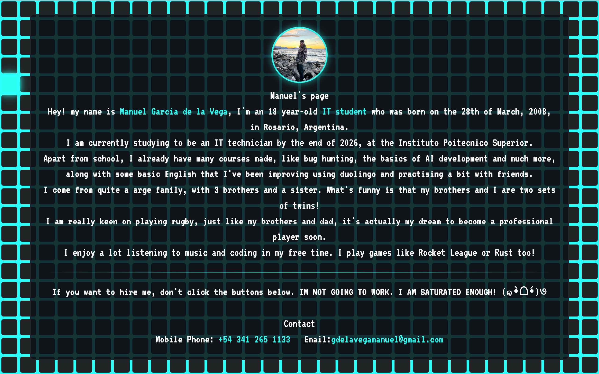
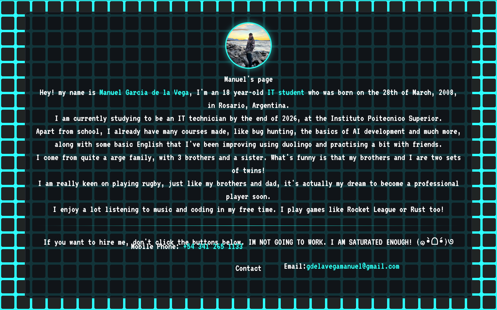
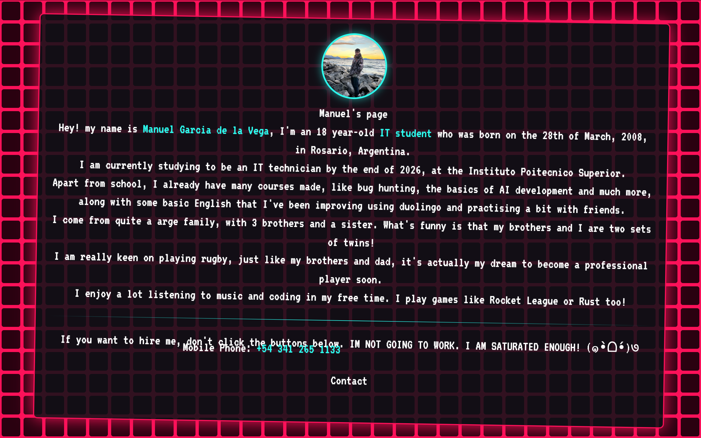
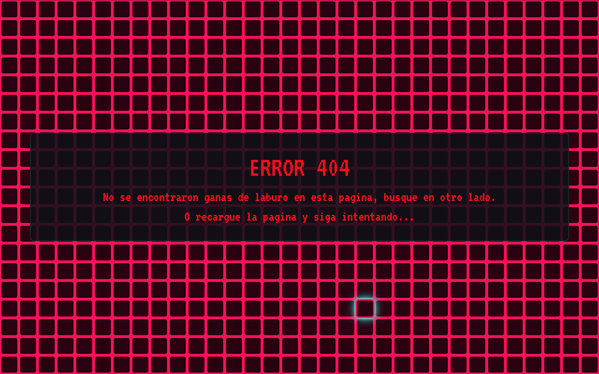
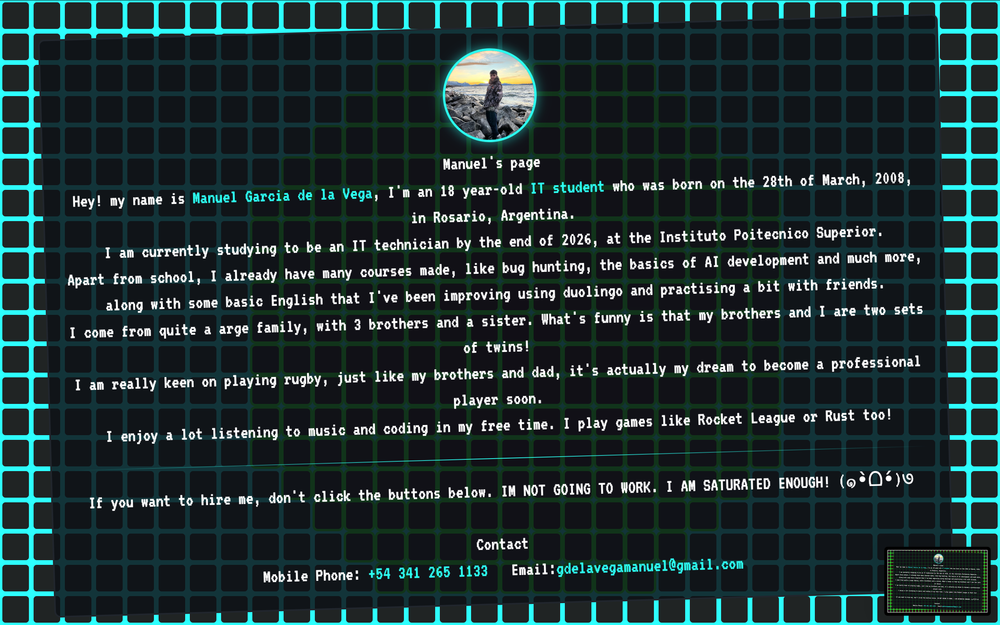
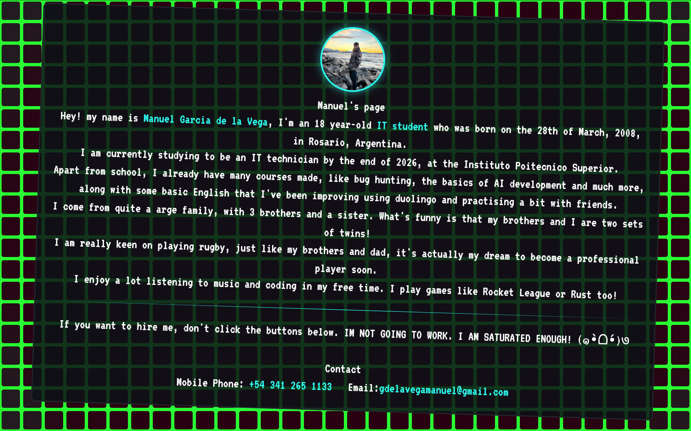
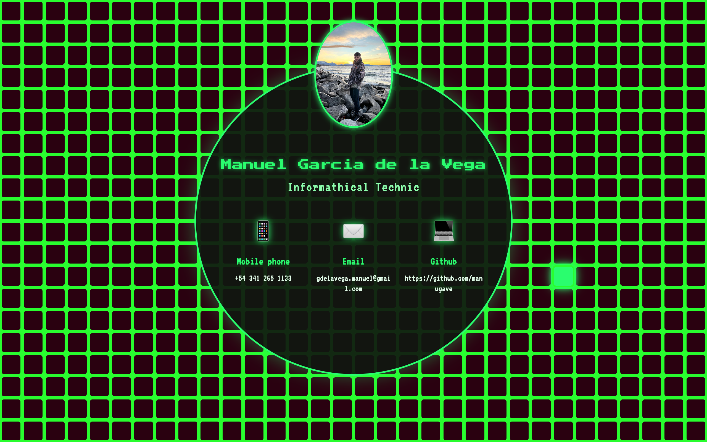

# ProyectoBeest

## What i did?
I made a page that's like a contact me page to get work.

It has a plain text with information about me and what i did, do and will do.(hice hago y voy a hacer).This site looks like a normal and boring website, but it isn't my way of make the things, i like put in the life a little piece of fun always.

And because of that the website has a little plot-twist! If you want to press in my "contact links" to get my contact, they will dodge your pointer. And if you reacheda and could click the links, you will see that the page explodes and gives you an error page that says "I dont wanna work, search in other page"

And if you keep searching and find out that my profile image is a button and then press it, you will see my contact information and github.

## Why i did it?

I did it because I always wanted to have a page that I can share with my friends, family and the people who wanna hire me.

It isn't serius and looks like a joke, but it shows that side of my person that I'm proud.

Also i made the website because I usually program at html and tsx but never without AI.
I started to notice that i didn't understand what i was programming and i decided take this challenge to make me grow up and have fun about programming.

And obviously, when i saw that i can but Subnautica 2 by programming, i was so happy of doing this.

## How i did it?

I made the structure using html, I made the design and part of some funcions with css and tailwind, it could look like basic because I'm starting in the world of this yet. And I made all the other functions with Javascript because I enjoy use it and I already know a little bit of this lenguage.

To the pixel painting i made it in 2 ways. For the blue panel, I used in css the class/property pixel:hover.
The other way was make it with Javascript with an eventListener mouseover and other eventListener mouseout.
To the changes of cards i used classLists, the property hidden that is declared at the css, and the js function, classList.remove.

To the propagation of the green card I made a function that finds the position in the center of the screen.
I made it with the Pitagoras theorem and a foreach per pixel with a cicle with an index called i.

## Demo

There are some images in a way of preview of the website.

##

Escentially that's it.

If you wanna contact me for something, you have the data and the way to obtain it there!

